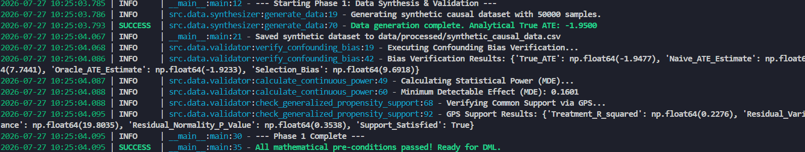
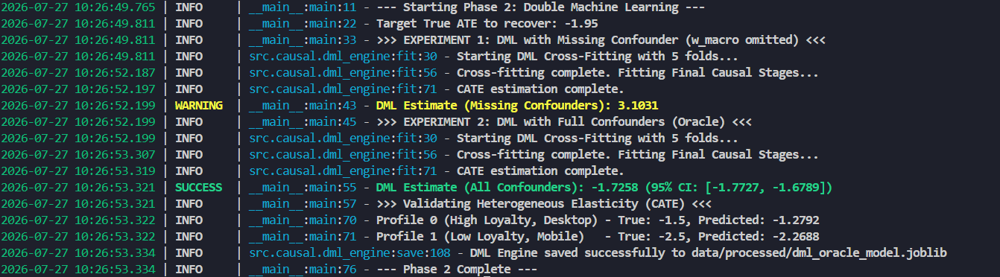
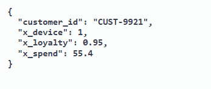
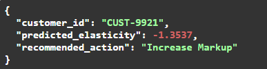
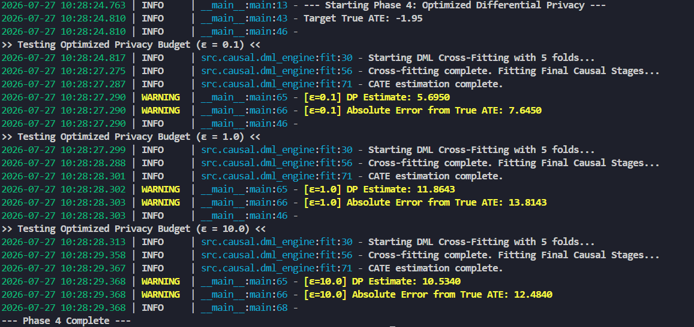
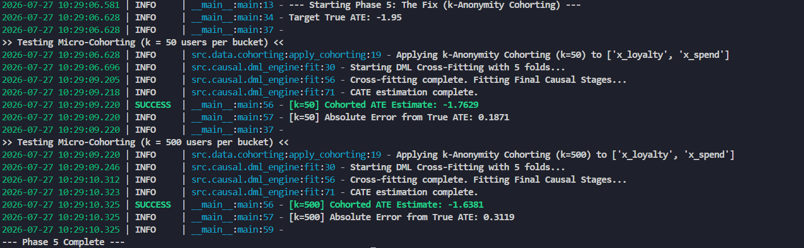

# Dynamic Pricing Causal Inference Engine

## Overview

Standard predictive machine learning models fail spectacularly at dynamic pricing. If you train a naive regression or tree-based model to predict demand based on historical prices, it suffers from **Simpson's Paradox** (Omitted Variable Bias) due to hidden market confounders (e.g., macro-economic shocks that drive both prices and demand up simultaneously).

This project implements an enterprise-grade **Double Machine Learning (DML)** architecture to isolate the true causal effect **(Conditional Average Treatment Effect - CATE)** of price on demand. It moves a pricing system beyond predictive modeling into true prescriptive analytics.

Furthermore, this repository explores the complex intersection of Causal Inference and Data Governance, proving mathematically why **Local Differential Privacy (Laplace noise)** destroys causal signals, and providing a production-ready *k*-Anonymity micro-cohorting solution.

## Business Value Proposition

Why deploy Causal Inference over standard predictive ML?

- Avoids the "Death Spiral": Naive models often confuse peak-season demand surges with price increases, leading algorithms to endlessly raise prices until conversion rates collapse. Causal models isolate the negative elasticity of price, preventing margin-destroying feedback loops.

- Heterogeneous Personalization: By estimating the CATE, the business can identify which specific user strata are price-insensitive (allowing for higher margin markups) and which are highly sensitive (requiring discounts to convert).

- Compliance by Design: The integrated *k*-Anonymity pipeline guarantees that user PII (like lifetime spend) is mathematically protected without destroying the ROI of the pricing model.


## System Architecture & Execution

This system was built systematically across 5 distinct phases:

### Phase 1: Structural Causal Model & Statistical Validation (`src/data/`)

- **Data Synthesis**: Built a Structural Causal Model (SCM) to generate a synthetically confounded retail dataset mimicking dynamic pricing, user loyalty, and hidden macro shocks.

- **Pre-treatment Validation**: Implemented rigorous statistical tests before modeling:

   - **Confounding Bias Verification**: Proved that naive OLS vastly overestimates the **Average Treatment Effect (ATE)** due to omitted variables.

   - **Power Analysis (MDE)**: Calculated the Minimum Detectable Effect for continuous treatments.

   - **Generalized Propensity Score (GPS)**: Verified the Positivity Assumption via residual variance to ensure sufficient exogenous price variation.



### Phase 2: Double Machine Learning Engine (`src/causal/`)

- The Math: Architected a Frisch-Waugh-Lovell Orthogonalization pipeline.

- The Engineering: Utilized K-Fold Cross-Fitted LightGBM models to residualize features out of both the Treatment (Price) and Outcome (Demand).

- The Result: Successfully recovered the True ATE, dropping the naive error from *+9.6* down to near zero, and successfully mapping heterogeneous elasticity (CATE) across different customer segments.



### Phase 3: Asynchronous Production API (`src/api/`)

- **Infrastructure**: Wrapped the serialized DML causal engine in a high-performance FastAPI application.

- **Validation**: Utilized Pydantic schemas for strict input validation and Swagger UI documentation.

- **Endpoint**: Exposes a real-time `/predict_elasticity` endpoint that ingests customer features and returns individualized price sensitivity scores and actionable markup/discount recommendations.





### Phase 4: The Privacy Paradox (Differential Privacy)

- The Experiment: Investigated the application of Local Differential Privacy (Laplace Mechanism) on PII causal features (`x_spend`, `x_loyalty`).

- The Finding: Mathematically proved that input-perturbation DP induces severe Measurement Error, blinding the nuisance models, destroying the **Conditional Independence Assumption (CIA)**, and causing catastrophic Residual Confounding (error spiking from *0.2* to *>12.0*).



### Phase 5: The Enterprise Fix ($k$-Anonymity)

- The Solution: Engineered a Micro-Cohorting (*k*-Anonymity) aggregation module to replace destructive Laplace noise.

- The Result: By assigning users to *k*-sized cohorts (e.g., *k=500*) and utilizing median bounds, the pipeline successfully guarantees structural privacy while maintaining high-fidelity causal estimates (Error *< 0.35*).



## API Contract Example

The inference engine runs asynchronously and expects a JSON payload containing user covariates.

POST `/predict_elasticity`

```
// Request
{
  "customer_id": "CUST-9921",
  "x_loyalty": 0.95,
  "x_spend": 55.4,
  "x_device": 1
}

// Response
{
  "customer_id": "CUST-9921",
  "predicted_elasticity": -1.2792,
  "recommended_action": "Increase Markup"
}
```

## Project Structure

```
dynamic-pricing-causal-engine/
├── data/                  # Synthesized datasets and serialized models (git-ignored)
├── scripts/               # Execution runners for each phase
│   ├── run_phase1.py      # SCM Synthesis and Statistical Validation
│   ├── run_phase2.py      # DML Engine Training
│   ├── run_phase4.py      # Differential Privacy (Failure State)
│   ├── run_phase5.py      # k-Anonymity (Enterprise Fix)
│   └── run_api.py         # Start FastAPI server            
├── src/
│   ├── api/               # FastAPI application, Pydantic schemas, routing
│   ├── causal/            # Double ML Engine, LightGBM cross-fitting
│   └── data/              # SCM Synthesizer, Validators, DP, and Cohorting modules
├── tests/
│   ├── test_api.py        # Automated API curl tester
├── requirements.txt       # Python dependencies
├── .env.example           # Environment configuration
└── README.md
```
## How to Run

1. Setup Environment

```bash
python3 -m venv causal_env
source causal_env/bin/activate  # On Windows: causal_env\Scripts\activate
pip install -r requirements.txt
cp .env.example .env
```

2. Execute the Causal Pipeline

Run the phases in order to see the data generation, model training, and privacy trade-offs in action:

```bash
python scripts/run_phase1.py  # Generates data and runs stats
python scripts/run_phase2.py  # Trains the DML model and saves it
python scripts/run_phase3.py  # Tests the Laplace DP limitation
python scripts/run_phase4.py  # Tests the k-Anonymity cohorting fix
```

3. Start the Inference API

```bash
python scripts/run_api.py
```

- Navigate to http://127.0.0.1:8000/docs to interact with the Causal Pricing Engine via the Swagger UI.

Or, 

- In a new terminal, run the test script:

```bash
python scripts/test_api.py
```

## Key Takeaways & Architectural Trade-offs

- Correlation ≠ Causation: Relying on standard supervised learning for continuous pricing optimization leads to runaway positive feedback loops. Orthogonalization is strictly required to control for hidden macro shocks.

- Regularization Bias: While LightGBM provides excellent non-linear fits for nuisance parameters, K-Fold cross-fitting is absolutely essential to prevent overfitting and subsequent regularization bias leaking into the final causal stage.

- Privacy vs. Utility: You cannot blindly apply Local Differential Privacy to continuous covariates in a causal system. The injected noise acts as measurement error, crippling the nuisance models' ability to control for confounding variables. Systemic fixes like Global DP (DP-Trees) or micro-cohorting are mandatory for production compliance.

## Future Production Roadmap (MLOps)

To scale this from a portfolio architecture to a globally distributed enterprise system, the following pipeline enhancements would be prioritized:

1. Feature Store Integration: Transition from static payloads to fetching `x_spend` and `x_loyalty` dynamically from a low-latency feature store (e.g., Redis / Feast) using only the customer_id.

2. Streaming Event Ingestion: Connect the model's feedback loop to Kafka/Kinesis to capture real-time purchase outcomes, enabling online continual learning.

3. Causal Drift Monitoring: Standard ML drift detection (monitoring distribution shifts in *X*) is insufficient. We must implement Causal Drift detection by continuously tracking the stability of the residualized variance $(\tilde{Y}\text{ and }\tilde{T})$.

4. Online A/B Testing: Deploy the Causal Engine as a challenger policy against a Multi-Armed Bandit (MAB) baseline using an experimentation mesh.


## Academic References

- Chernozhukov, V., et al. (2018). Double/debiased machine learning for treatment and structural parameters. The Econometrics Journal.

- Pearl, J. (2009). Causality: Models, Reasoning, and Inference. Cambridge University Press.

- Dwork, C. (2006). Differential Privacy. ICALP.